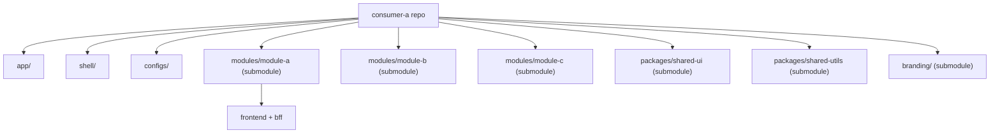

# Architecture

Consumer-repo blueprint: each consumer (`consumer-a`, `consumer-b`, ...) owns a fork of this repository. Local code (`app/`, `shell/`, `configs/`) lives per-consumer; shared code is pulled in via Git Submodules — each module is its **own** submodule (not one shared `modules` repo), so `module-a`, `module-b`, and `module-c` can each be versioned, branched, and deployed independently.

## Repository structure

## Dependency rules

- `app` → `shell`, `shared-ui`, `shared-utils`, `branding`
- `shell` → `shared-ui`, `shared-utils`, `branding`, module entry points (via module loader only)
- `module-*` → `shared-ui`, `shared-utils` only — never `shell`, never another module
- `module-*/frontend` → `module-*/bff` → backend service (never BFF → BFF)

Enforced by `eslint-plugin-boundaries` (`.eslintrc.json` at repo root).

## Why consumer-repo + submodules, not a monorepo

Each consumer needs independently versioned layout/auth/routing while sharing modules and design system. A monorepo would force all consumers onto one deploy cadence and one repo's CI; submodules let each module, `shared-ui`, `shared-utils`, and `branding` be pinned per-consumer at independent commits while shell code stays consumer-local. Splitting modules into one submodule each (rather than one shared `modules` repo) means `module-a` can ship a fix without bumping `module-b`/`module-c` in any consumer that doesn't need it.
