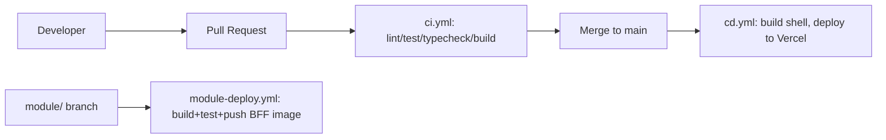

# Deployment

## Targets

| Component | Target | Trigger |
|---|---|---|
| Shell (`app/` + `shell/`) | Vercel | push to `main` (`.github/workflows/cd.yml`) |
| Module frontends | Bundled into shell build at consumer build time (no separate frontend deploy) | shell build |
| Module BFFs | Containers (Docker), one image per module | push to `module/<id>` branch (`.github/workflows/module-deploy.yml`) |

## Environment strategy

- `development` — local `.env`, services on localhost ports per `.env.example`.
- `staging` / `production` — secrets injected from Vault at deploy time; never committed.

## Dockerfiles

Each module BFF ships its own `Dockerfile` (`modules/module-a/bff/Dockerfile`) — multi-stage build, non-root final image, `/health` and `/ready` endpoints for container healthchecks.
