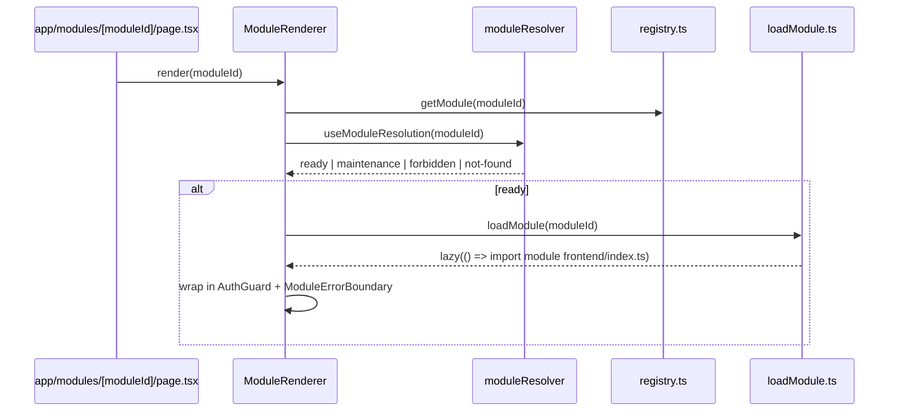
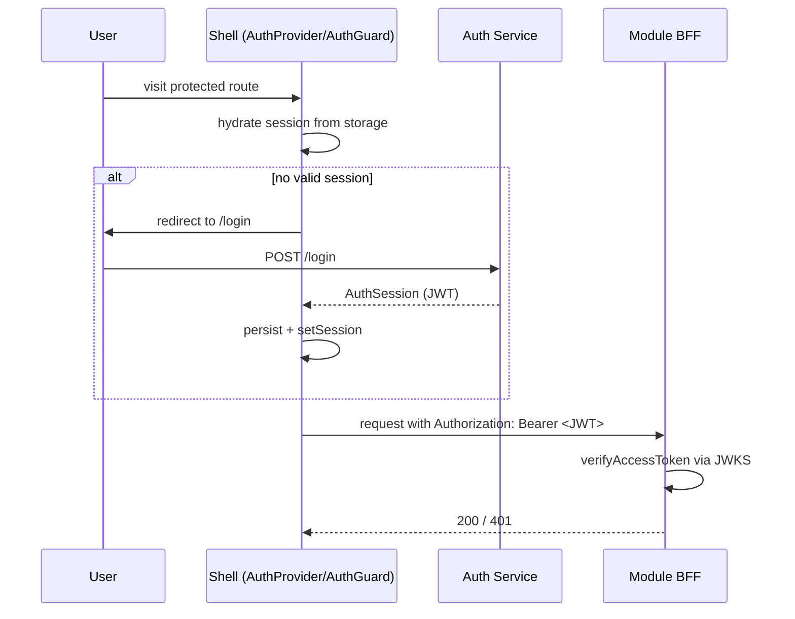
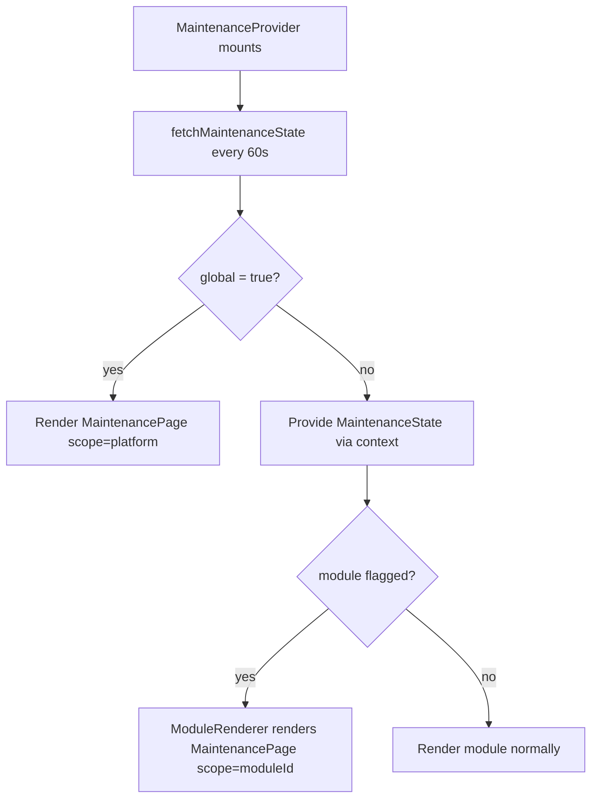
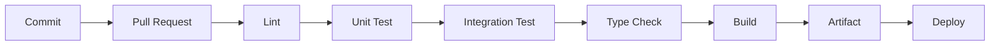

# Diagrams

## 1. Architecture

See [architecture.md](./architecture.md#repository-structure).

## 2. Module Loading Flow



## 3. Authentication Flow



## 4. Theme Loading Flow

See [theme-system.md](./theme-system.md#flow).

## 5. Maintenance Flow



## 6. CI/CD Flow



## 7. Deployment Flow

See [deployment.md](./deployment.md#environment-strategy).

## 8. BFF Flow

```mermaid
flowchart LR
    FE[Module Frontend] --> BFF[Module BFF]
    BFF --> Backend[Backend Service]
    BFF -.x.-> OtherBFF[Another Module's BFF]
    style OtherBFF stroke:#ef4444,stroke-dasharray: 5 5
```

## 9. Git Submodule Flow

```mermaid
flowchart TD
    Source["Submodule source repo\n(e.g. shared-ui)"] -- git push --> SourceRemote[Remote]
    SourceRemote -- git submodule update --remote --> Consumer["Consumer repo\n(pinned commit in .gitmodules)"]
    Consumer -- git add + commit --> ConsumerRemote[Consumer remote]
```
