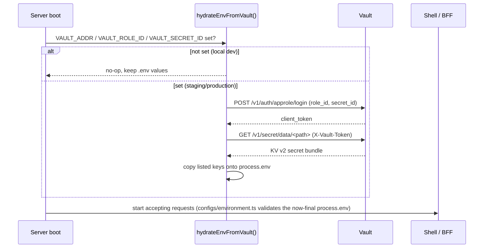

# Secrets Management (Vault)

Sensitive configuration — the JWT issuer/audience/JWKS URL, the auth/theme/maintenance service URLs, and each module BFF's backend API key — is **not** committed to this repo. In staging/production it's fetched from HashiCorp Vault at process boot, before the app accepts any traffic. Locally, with no Vault credentials set, it falls back to the plaintext values in `.env`.

## How it works



### Shell (Next.js)

- `instrumentation.ts` (project root) exports `register()`, which Next.js calls once when the server process starts, before it handles any request.
- `register()` calls `shell/services/secrets.service.ts#loadSecretsFromVault()`, which hydrates: `THEME_SERVICE_URL`, `AUTH_SERVICE_URL`, `MAINTENANCE_SERVICE_URL`, `JWT_ISSUER`, `JWT_AUDIENCE`, `JWT_PUBLIC_KEY_URL`.
- `configs/environment.ts#getEnv()` is **lazy and cached** — it only reads/validates `process.env` the first time something calls it (e.g. `theme.service.ts`, `auth.service.ts`, `maintenance.service.ts`, `jwt.service.ts`), which by then is always after `register()` has finished. Nothing imports the old eager `env` export anymore.

### Module BFF (Express)

- `modules/module-a/bff/server.ts` calls `services/secrets.service.ts#loadSecretsFromVault()` inside an async `bootstrap()` function, awaited **before** `app.listen()`.
- It hydrates `BACKEND_SERVICE_API_KEY`, which `clients/backendClient.ts#fetchFromBackend()` then attaches as `Authorization: Bearer <key>` on every call to the module's own backend service.
- Bootstrap is skipped when `process.env.VITEST` is set, so importing `app` in `tests/integration/bmi.integration.test.ts` doesn't try to reach a real Vault or double-bind the port.

### The actual Vault client

`packages/shared-utils/src/vault/`:

- `vaultClient.ts#fetchVaultSecrets()` — does the two HTTP calls: AppRole login, then KV v2 read. Framework-agnostic, used by both the shell and any BFF.
- `hydrateEnv.ts#hydrateEnvFromVault({ keys, secretPath, logger })` — the no-op-if-unconfigured wrapper that copies only the named keys onto `process.env`. This is what both `loadSecretsFromVault()` implementations call.

This lives in `shared-utils` (not `shell`) because both the consumer shell and every module's BFF need it, and it has no business logic — just an HTTP utility, consistent with `shared-utils`' charter.

## Vault setup (one-time, per environment)

```bash
# Enable AppRole auth (once per Vault cluster)
vault auth enable approle

# Write a policy allowing read-only access to this consumer's secret path
vault policy write consumer-a-policy - <<EOF
path "secret/data/consumer-a" {
  capabilities = ["read"]
}
path "secret/data/consumer-a-module-a-bff" {
  capabilities = ["read"]
}
EOF

# Create an AppRole bound to that policy
vault write auth/approle/role/consumer-a-app policies="consumer-a-policy" token_ttl=1h token_max_ttl=4h

# Fetch the role_id (goes in VAULT_ROLE_ID) and generate a secret_id (goes in VAULT_SECRET_ID)
vault read auth/approle/role/consumer-a-app/role-id
vault write -f auth/approle/role/consumer-a-app/secret-id

# Write the actual secret bundle the shell reads
vault kv put secret/consumer-a \
  THEME_SERVICE_URL=https://api.consumer-a.example.com/theme \
  AUTH_SERVICE_URL=https://api.consumer-a.example.com/auth \
  MAINTENANCE_SERVICE_URL=https://api.consumer-a.example.com/maintenance \
  JWT_ISSUER=https://auth.consumer-a.example.com \
  JWT_AUDIENCE=consumer-a \
  JWT_PUBLIC_KEY_URL=https://auth.consumer-a.example.com/.well-known/jwks.json

# Write the module-a BFF's own secret bundle
vault kv put secret/consumer-a-module-a-bff \
  BACKEND_SERVICE_API_KEY=<real-api-key>
```

## Deploying with Vault credentials

`VAULT_ADDR`, `VAULT_ROLE_ID`, `VAULT_SECRET_ID` (and `VAULT_SECRET_PATH` if non-default) are the *only* Vault-related values that ever reach a real environment, and they're injected by the deploy platform itself — never committed:

- **Vercel** (shell): Project Settings → Environment Variables, scoped to Production/Preview.
- **Container/Kubernetes** (module BFFs): injected as a Kubernetes `Secret` mounted as env vars, or via the platform's secret-injection sidecar.

`secret_id`s should be short-lived and rotated — re-run `vault write -f auth/approle/role/<role>/secret-id` and update the deploy platform's stored value rather than reusing one indefinitely.

## Why this design

- **Nothing sensitive is ever in `.env.example`, `.env`, or git history** — only safe localhost defaults that are meaningless outside a dev machine.
- **No app code changes when secrets rotate** — rotating a value in Vault takes effect on the next process restart, no redeploy of code.
- **Local dev still works with zero Vault setup** — `hydrateEnvFromVault()` is a clean no-op when the three AppRole env vars aren't set, so `.env` alone is enough to run `pnpm dev`.
