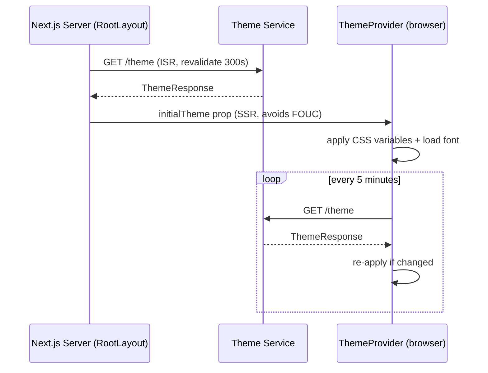

# Dynamic Theme System

Theme is owned by the backend, not the repo. `GET /theme` returns:

```json
{
  "primaryColor": "#2563eb",
  "secondaryColor": "#22c55e",
  "fontFamily": "CompanyFont",
  "fontUrl": "https://cdn.company.com/company-font.woff2"
}
```

## Flow



## Implementation

- `shell/services/theme.service.ts#fetchTheme` — typed fetch validated by `configs/theme.ts#themeResponseSchema`.
- `shell/providers/ThemeProvider.tsx` — receives SSR `initialTheme`, polls client-side, writes `--color-primary`/`--color-secondary`/`--font-family` via `shell/utils/cssVariables.ts`, loads the font via `shell/utils/fontLoader.ts`.
- `shell/hooks/useTheme.ts` — read access for any component.
